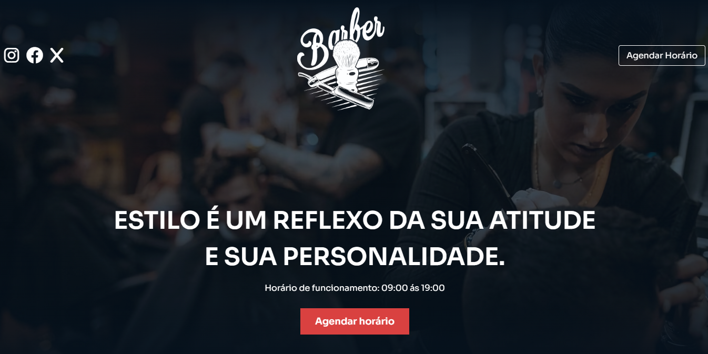

# Projeto Barbearia

## 💻 Projeto

Esse é um projeto web Responsivo de uma barbearia. Projeto realizado conforme video-aula do "Sujeito-Programador".

## 🚀 Tecnologias

## Extenções usadas

<a href="https://fonts.google.com/specimen/Sora" target="_blank">Google Fonts</a> 
<a href="https://drive.google.com/file/d/13lnB6_US9f8E7GpUucRSBPF-CGjAOzTR/view" target="_blank">Biblioteca de icons</a> 
<a href="https://michalsnik.github.io/aos/" target="_blank">Animate On Scroll Library</a>

## Créditos

<a href="https://www.youtube.com/watch?v=Fzc_dnqD-V0" target="_blank">Projeto da video aula: Sujeito programador</a>

